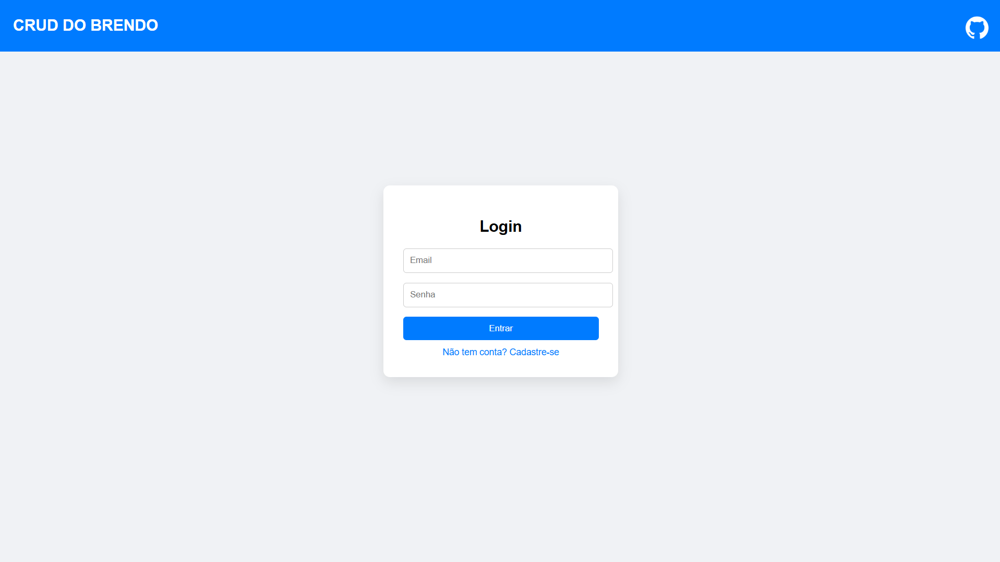
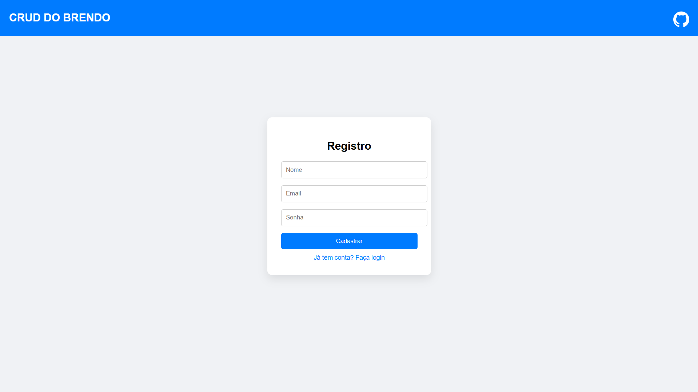
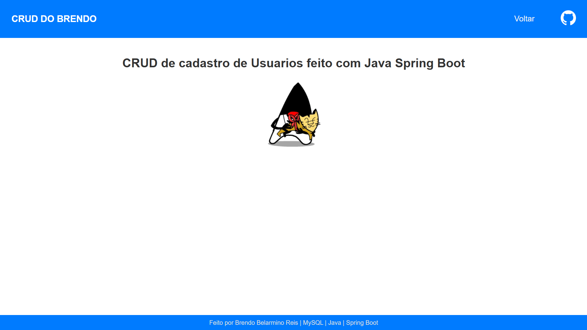

# 🚀 Java-CRUD-Usuarios-Fullstack


---

## 📌 Descrição

**Java-CRUD-Usuarios-Fullstack** é um projeto **fullstack** que implementa **login e cadastro de usuários** com front-end integrado, usando **Java, Spring Boot e MySQL**.
O sistema permite que usuários se cadastrem, façam login e tenham seus dados armazenados no banco. Também é possível consultar, atualizar e deletar usuários via API, com testes realizados no **Postman**.

---

## ⚙️ Funcionalidades

* Cadastro de usuários via formulário ou JSON.
* Login com validação de email e senha.
* Consulta, atualização e exclusão de usuários via API.
* Front-end integrado com backend.
* Persistência de dados em **MySQL**.

---

## 📂 Estrutura de arquivos

```
Java-CRUD-Usuarios-Fullstack/
│
├── src/
│   ├── main/
│   │   ├── java/com/brendo/cadastrousuario/
│   │   │   ├── controller/UsuarioController.java
│   │   │   ├── business/UsuarioService.java
│   │   │   └── infrastructure/
│   │   │       ├── entitys/Usuario.java
│   │   │       └── repository/UsuarioRepository.java
│   │   └── resources/
│   │       ├── application.properties
│   │       └── templates/
│   │           ├── index.html
│   │           ├── register.html
│   │           ├── home.html
│   │           └── CSS/ (estilos do front-end)
│   └── test/java/ (testes unitários e de integração)
│
├── logojava.png (favicon)
├── pom.xml
└── README.md

```

---

## 💻 Tecnologias utilizadas

* **Java 23**
* **Spring Boot 3.5.6**
* **Spring Data JPA**
* **MySQL**
* **Lombok**
* **HTML/CSS** (front-end)
* **Postman** (teste de APIs)

---

## ▶️ Como executar

1. Clone o repositório:

   ```bash
   git clone https://github.com/seu-usuario/java-crud-usuarios-fullstack.git
   ```
2. Configure o banco MySQL (`crud`) e atualize `application.properties` com seu usuário e senha.
3. Compile e execute a aplicação Spring Boot via IDE ou Maven:

   ```bash
   mvn clean install
   mvn spring-boot:run
   ```
4. Acesse o front-end pelo navegador:

   ```
   http://localhost:8080/index.html
   ```
5. Teste APIs via Postman (opcional) usando os endpoints de `UsuarioController`.

---

## 📸 Screenshots

**Front-end login:**


**Front-end registro:**


**Front-end home:**


---


